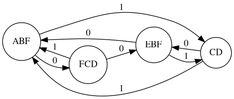
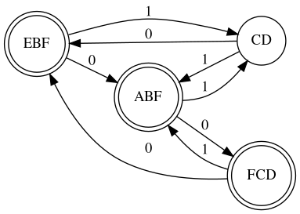

# Epsilon NFA to DFA

This project converts the NFA with epsilon move to DFA. Additionally It uses GraphViz library to generate the Digraph of the output DFA.

## Dependencies
1. Dot Lang
2. GraphViz

## Clone
```
git clone https://github.com/IAMIQBAL/epsilon-NFA-to-DFA/
cd epsilon-NFA-to-DFA
```

The tests directory contains some output DFA's generated.

### 1. DFA 1


### 2. DFA 2


### Sample Dot Language Code for DFA 1

```
digraph finite_state_machine {
  rankdir=LR; 
  size="8,5" 
  node [shape = doublecircle];ABC BC C ;
  node [shape = circle];
  ABC->BC[label = 0];
  ABC->ABC[label = 1];
  BC->C[label = 0];
  BC->BC[label = 1];
  C->C[label = 0];
  C->C[label = 1];
}
```
